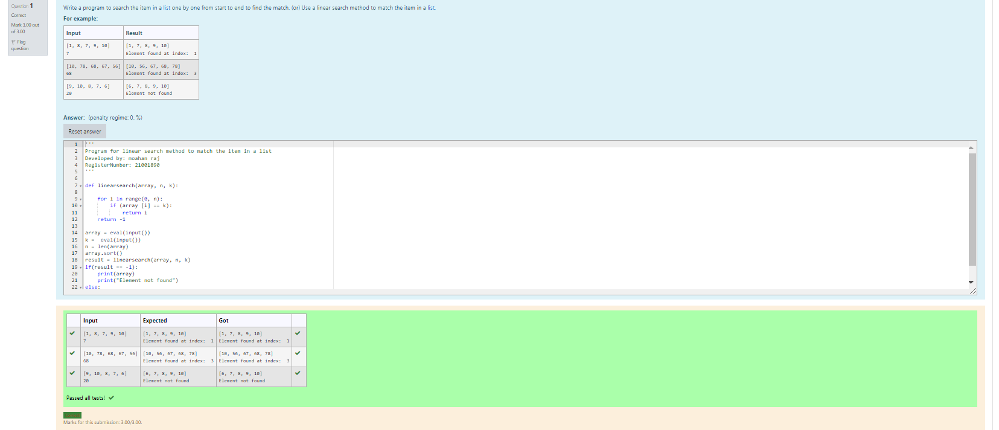
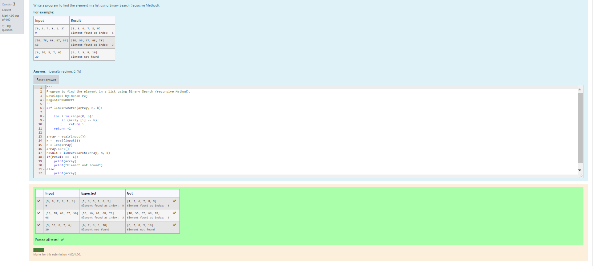

# Find the maximum of a list of numbers
## Aim:
To write a program to find the maximum of a list of numbers.
## Equipment’s required:
1.	Hardware – PCs
2.	Anaconda – Python 3.7 Installation / Moodle-Code Runner
## Algorithm:
1.	Get the list of marks as input
2.	Use the sort() function or max() function or use the for loop to find the maximum mark.
3.	Return the maximum value
## Program:

i)	# To find the maximum of marks using the list method sort.
```Python
''' 
Program for linear search method to match the item in a list
Developed by: moahan raj
RegisterNumber: 21001890
'''

def linearsearch(array, n, k):

    for i in range(0, n):
        if (array [i] == k):
            return i
    return -1

array = eval(input())
k =  eval(input())
n = len(array)
array.sort()
result = linearsearch(array, n, k)
if(result == -1):
    print(array)
    print("Element not found")
else:
    print(array)
    print("Element found at index: ", result)


```

ii)	# To find the maximum marks using the list method max().
```Python
''' 
Program to find the element in a list using Binary Search(Iterative Method)..
Developed by: mohan raj
RegisterNumber: 21001890
'''
def linearSearch(array,n,k):
    for i in range(0,n):
        if (array[i] == k):
            return i
    return -1
array = eval(input())
n = len(array)
k = int(input())
array.sort()
result = linearSearch(array,n,k)
if (result == -1):
    print(array)
    print("Element not found")
else:
    print(array)
    print("Element found at index: ",result)


```

iii) # To find the maximum marks without using builtin functions.
```Python

''' 
Program to find the element in a list using Binary Search (recursive Method).
Developed by:mohan raj
RegisterNumber: 
'''
def linearsearch(array, n, k):

    for i in range(0, n):
        if (array [i] == k):
            return i
    return -1

array = eval(input())
k =  eval(input())
n = len(array)
array.sort()
result = linearsearch(array, n, k)
if(result == -1):
    print(array)
    print("Element not found")
else:
    print(array)
    print("Element found at index: ", result)

```
## Sample Input and output


## Output:

## Result:
Thus the program to find the maximum of given numbers from the list is written and verified using python programming.